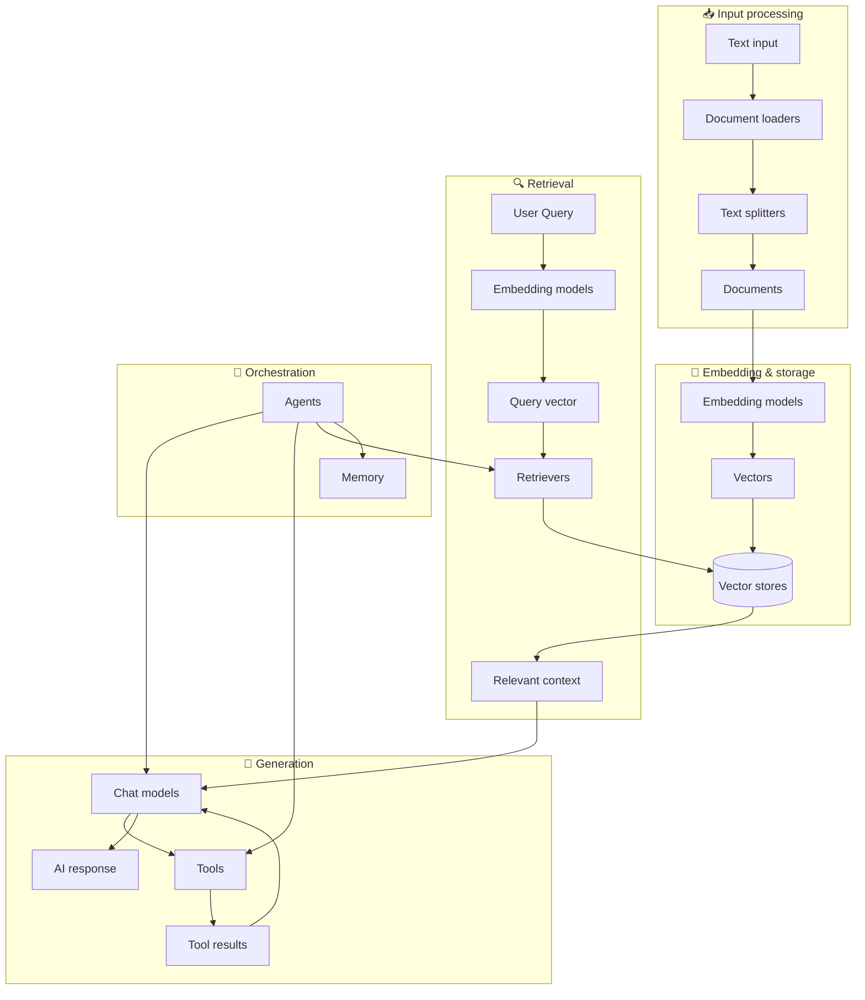
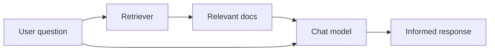
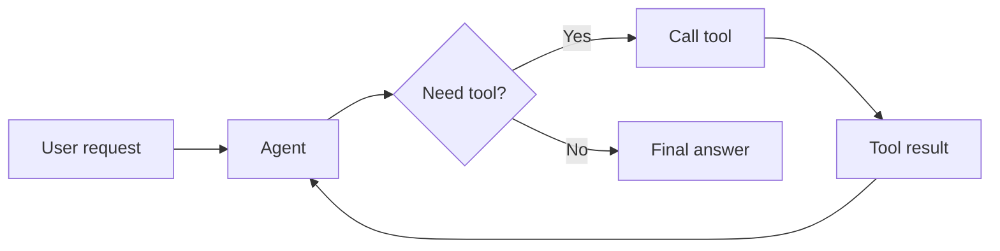
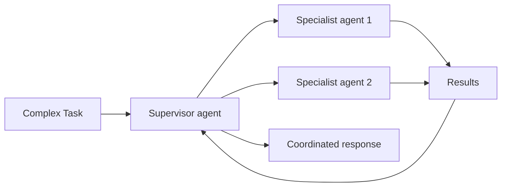

LangChain's power comes from how its components work together to create sophisticated AI applications. This page provides diagrams showcasing the relationships between different components.

## Core component ecosystem

The diagram below shows how LangChain's major components connect to form complete AI applications:

### How components connect

Each component layer builds on the previous ones:

1. **Input processing** – Transform raw data into structured documents
2. **Embedding & storage** – Convert text into searchable vector representations
3. **Retrieval** – Find relevant information based on user queries
4. **Generation** – Use AI models to create responses, optionally with tools
5. **Orchestration** – Coordinate everything through agents and memory systems

## Component categories

LangChain organizes components into these main categories:

| Category | Purpose | Key Components | Use Cases |
|----------|---------|---------------|-----------|
| **[Models](/oss/python/langchain/models)** | AI reasoning and generation | Chat models, LLMs, Embedding models | Text generation, reasoning, semantic understanding |
| **[Tools](/oss/python/langchain/tools)** | External capabilities | APIs, databases, etc. | Web search, data access, computations |
| **[Agents](/oss/python/langchain/agents)** | Orchestration and reasoning | ReAct agents, tool calling agents | Nondeterministic workflows, decision making |
| **[Memory](/oss/python/langchain/short-term-memory)** | Context preservation | Message history, custom state | Conversations, stateful interactions |
| **[Retrievers](/oss/python/integrations/retrievers)** | Information access | Vector retrievers, web retrievers | RAG, knowledge base search |
| **[Document processing](/oss/python/integrations/document_loaders)** | Data ingestion | Loaders, splitters, transformers | PDF processing, web scraping |
| **[Vector Stores](/oss/python/integrations/vectorstores)** | Semantic search | Chroma, Pinecone, FAISS | Similarity search, embeddings storage |

## Common patterns

### RAG (Retrieval-Augmented generation)

### Agent with tools

### Multi-agent system

## Learn more

- [Creating agents](/oss/python/langchain/agents)
- [Working with tools](/oss/python/langchain/tools)
- [Browse integrations](/oss/python/integrations/providers/overview)

---

<Callout icon="edit">
    [Edit this page on GitHub](https://github.com/langchain-ai/docs/edit/main/src/oss/langchain/component-architecture.mdx) or [file an issue](https://github.com/langchain-ai/docs/issues/new/choose).
</Callout>
<Callout icon="terminal-2">
    [Connect these docs](/use-these-docs) to Claude, VSCode, and more via MCP for real-time answers.
</Callout>
