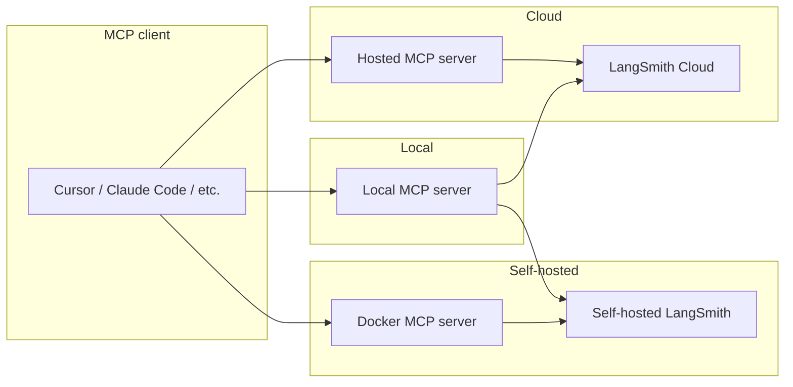

The **LangSmith MCP Server** is a [Model Context Protocol](https://modelcontextprotocol.io/introduction) (MCP) server that integrates with [LangSmith](https://smith.langchain.com). It lets MCP-compatible clients (for example, AI coding assistants) read [conversation history](/langsmith/observability-concepts#threads), [prompts](/langsmith/manage-prompts-programmatically), [runs and traces](/langsmith/observability-concepts#runs), [datasets](/langsmith/evaluation-concepts#datasets), [experiments](/langsmith/evaluation-concepts#experiment), and billing usage from your LangSmith workspace.

## Example use cases

- **Conversation history**: "Fetch the history of my conversation from thread 'thread-123' in project 'my-chatbot'"
- **Prompt management**: "Get all public prompts" or "Pull the template for the 'legal-case-summarizer' prompt"
- **Traces and runs**: "Fetch the latest 10 root runs from project 'alpha'" or "Get all runs for a trace by UUID"
- **Datasets**: "List datasets of type chat" or "Read examples from dataset 'customer-support-qa'"
- **Experiments**: "List experiments for dataset 'my-eval-set' with latency and cost metrics"
- **Billing**: "Get billing usage for September 2025"

<Tip>
**Use the server in code or Agent Builder**

- To connect and use remote MCP servers (including this one) in your Python application, see [MCP (Model Context Protocol)](/oss/langchain/mcp).
- To connect and use this server in Agent Builder, see [Remote MCP servers](/langsmith/agent-builder-remote-mcp-servers).
</Tip>

## Quickstart (hosted)

A hosted version of the LangSmith MCP Server is available over HTTP, so you can connect without running the server yourself.

- **URL:** `https://langsmith-mcp-server.onrender.com/mcp`
- **Authentication:** Send your [LangSmith API key](/langsmith/create-account-api-key) in the `LANGSMITH-API-KEY` header.

<Note>
The hosted instance is for [LangSmith Cloud](/langsmith/deploy-to-cloud). For a [self-hosted LangSmith](/langsmith/self-hosted) instance, run the server yourself and point it at your endpoint (see [Docker deployment](#docker-deployment-http-streamable)).
</Note>

**Example (Cursor `mcp.json`):**

```json
{
  "mcpServers": {
    "LangSmith MCP (Hosted)": {
      "url": "https://langsmith-mcp-server.onrender.com/mcp",
      "headers": {
        "LANGSMITH-API-KEY": "lsv2_pt_your_api_key_here"
      }
    }
  }
}
```

Optional headers: `LANGSMITH-WORKSPACE-ID`, `LANGSMITH-ENDPOINT` (same as in [Environment variables](#environment-variables)).

## Available tools

The server exposes these tool groups for LangSmith.

### Conversation and threads

| Tool | Description |
|------|-------------|
| `get_thread_history` | Get message history for a conversation thread. Uses character-based pagination: pass `page_number` (1-based) and use the returned `total_pages` to request more pages. Optional: `max_chars_per_page`, `preview_chars`. |

### Prompt management

| Tool | Description |
|------|-------------|
| `list_prompts` | List prompts with optional filtering by visibility (public/private) and limit. |
| `get_prompt_by_name` | Get a single prompt by exact name (details and template). |
| `push_prompt` | Documentation-only: how to create and push prompts to LangSmith. |

### Traces and runs

| Tool | Description |
|------|-------------|
| `fetch_runs` | Fetch runs (traces, tools, chains, etc.) from one or more projects. Supports filters (`run_type`, `error`, `is_root`), FQL (`filter`, `trace_filter`, `tree_filter`), and ordering. When `trace_id` is set, results are character-based paginated; otherwise one batch up to `limit`. Always pass `limit` and `page_number`. |
| `list_projects` | List projects with optional filtering by name, dataset, and detail level. |

### Datasets and examples

| Tool | Description |
|------|-------------|
| `list_datasets` | List datasets with filtering by ID, type, name, or metadata. |
| `list_examples` | List examples from a dataset by dataset ID/name or example IDs; supports filter, metadata, splits, and optional `as_of` version. |
| `read_dataset` | Read one dataset by ID or name. |
| `read_example` | Read one example by ID, with optional `as_of` version. |
| `create_dataset` | Documentation-only: how to create datasets. |
| `update_examples` | Documentation-only: how to update dataset examples. |

### Experiments and evaluations

| Tool | Description |
|------|-------------|
| `list_experiments` | List experiment (reference) projects for a dataset. Requires `reference_dataset_id` or `reference_dataset_name`. Returns metrics (latency, cost, feedback). |
| `run_experiment` | Documentation-only: how to run experiments and evaluations. |

### Billing

| Tool | Description |
|------|-------------|
| `get_billing_usage` | Get organization billing usage (e.g. trace counts) for a date range. Optional workspace filter. |

### Pagination (character-based)

Tools that return large payloads use **character-budget pagination** so responses stay within a size limit:

- **Used by:** `get_thread_history` and `fetch_runs` (when `trace_id` is set).
- **Parameters:** Send `page_number` (1-based) on each request. Optional: `max_chars_per_page` (default 25000, max 30000), `preview_chars` (truncate long strings with "... (+N chars)").
- **Response:** Includes `page_number`, `total_pages`, and the page payload. Request more by calling again with `page_number = 2`, then `3`, up to `total_pages`.
- **Benefits:** Pages are built by character count, not item count; no cursor or server-side state—just page numbers.

## Installation (run locally)

If you prefer to run the server locally (or use a self-hosted LangSmith endpoint), install it and configure your MCP client.

### Prerequisites

1. Install [uv](https://github.com/astral-sh/uv) (Python package installer):
   ```bash
   curl -LsSf https://astral.sh/uv/install.sh | sh
   ```

2. Install the package:
   ```bash
   uv run pip install --upgrade langsmith-mcp-server
   ```

### MCP client configuration

Add the server to your MCP client config. Use the path from `which uvx` for the `command` value.

**PyPI / uvx:**

```json
{
  "mcpServers": {
    "LangSmith API MCP Server": {
      "command": "/path/to/uvx",
      "args": ["langsmith-mcp-server"],
      "env": {
        "LANGSMITH_API_KEY": "your_langsmith_api_key",
        "LANGSMITH_WORKSPACE_ID": "your_workspace_id",
        "LANGSMITH_ENDPOINT": "https://api.smith.langchain.com"
      }
    }
  }
}
```

**From source** (clone [langsmith-mcp-server](https://github.com/langchain-ai/langsmith-mcp-server) first):

```json
{
  "mcpServers": {
    "LangSmith API MCP Server": {
      "command": "/path/to/uv",
      "args": [
        "--directory",
        "/path/to/langsmith-mcp-server",
        "run",
        "langsmith_mcp_server/server.py"
      ],
      "env": {
        "LANGSMITH_API_KEY": "your_langsmith_api_key",
        "LANGSMITH_WORKSPACE_ID": "your_workspace_id",
        "LANGSMITH_ENDPOINT": "https://api.smith.langchain.com"
      }
    }
  }
}
```

Replace `/path/to/uv`, `/path/to/uvx`, and `/path/to/langsmith-mcp-server` with your actual paths.

## Docker deployment (HTTP-streamable)

You can run the server as an HTTP service with Docker so clients connect via the HTTP-streamable protocol.

1. Build and run:
   ```bash
   docker build -t langsmith-mcp-server .
   docker run -p 8000:8000 langsmith-mcp-server
   ```
   Use the [langsmith-mcp-server](https://github.com/langchain-ai/langsmith-mcp-server) repository for the Dockerfile and context.

2. Connect your MCP client to `http://localhost:8000/mcp` with the `LANGSMITH-API-KEY` header (and optional `LANGSMITH-WORKSPACE-ID`, `LANGSMITH-ENDPOINT`).

3. Health check (no auth):
   ```bash
   curl http://localhost:8000/health
   ```

For full Docker and HTTP-streamable details, see the [LangSmith MCP Server repository](https://github.com/langchain-ai/langsmith-mcp-server).

## Deployment overview

Use the **hosted** MCP server to connect to [LangSmith Cloud](/langsmith/cloud) (smith.langchain.com or eu.smith.langchain.com). Run the server **locally** ([Installation (run locally)](#installation-run-locally)) to connect to Cloud or [self-hosted LangSmith](/langsmith/self-hosted) (via `LANGSMITH_ENDPOINT`). If you use self-hosted LangSmith, you can instead run the server via the [Docker image](#docker-deployment-http-streamable) in your VPC so it can reach your self-hosted instance.



## Environment variables

| Variable | Required | Description |
|----------|----------|-------------|
| `LANGSMITH_API_KEY` | Yes | Your [LangSmith API key](/langsmith/create-account-api-key) for authentication. |
| `LANGSMITH_WORKSPACE_ID` | No | Workspace ID when your API key has access to multiple workspaces. |
| `LANGSMITH_ENDPOINT` | No | API endpoint URL (for [self-hosted](/langsmith/self-hosted) or custom regions). Default: `https://api.smith.langchain.com`. |

For the **hosted** server, use the same names as **headers**: `LANGSMITH-API-KEY`, `LANGSMITH-WORKSPACE-ID`, `LANGSMITH-ENDPOINT`.

## TypeScript implementation

A community-maintained TypeScript/Node.js port of the official Python server is available. To run it: `LANGSMITH_API_KEY=your-key npx langsmith-mcp-server`.

Source and package: [GitHub](https://github.com/amitrechavia/langsmith-mcp-server-js) · [npm](https://www.npmjs.com/package/langsmith-mcp-server). Maintained by [amitrechavia](https://github.com/amitrechavia).
