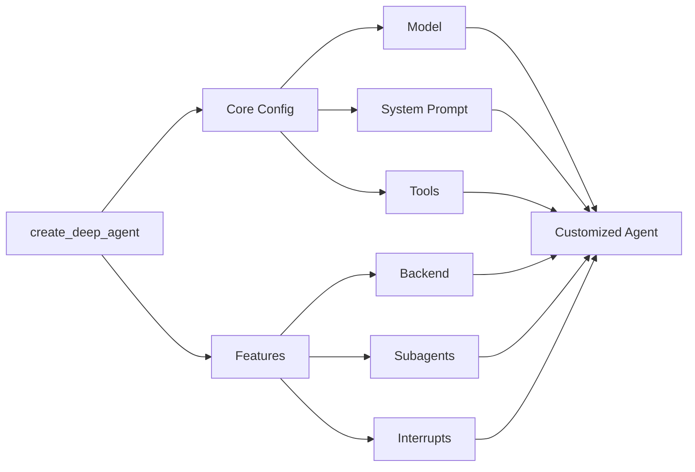

## Model

By default, `deepagents` uses [`claude-sonnet-4-5-20250929`](https://platform.claude.com/docs/en/about-claude/models/overview). You can customize the model used by passing any supported <Tooltip tip="A string that follows the format `provider:model` (e.g. openai:gpt-5)" cta="See mappings" href="https://reference.langchain.com/python/langchain/models/#langchain.chat_models.init_chat_model(model)">model identifier string</Tooltip> or [LangChain model object](/oss/integrations/chat).

<Tip>
    Use the `provider:model` format (e.g., `openai:gpt-5`) to quickly switch between models.
</Tip>

:::python
<CodeGroup>
    ```python Model string
    from langchain.chat_models import init_chat_model
    from deepagents import create_deep_agent

    model = init_chat_model(model="openai:gpt-5")
    agent = create_deep_agent(model=model)
    ```

    ```python LangChain model object
    # ollama pull llama3.1
    from langchain_ollama import ChatOllama
    from langchain.chat_models import init_chat_model
    from deepagents import create_deep_agent

    model = init_chat_model(
        model=ChatOllama(
            model="llama3.1",
            temperature=0,
            # other params...
        )
    )
    agent = create_deep_agent(model=model)
    ```
</CodeGroup>
:::

:::js
```typescript
import { ChatAnthropic } from "@langchain/anthropic";
import { ChatOpenAI } from "@langchain/openai";
import { createDeepAgent } from "deepagents";

// Using Anthropic
const agent = createDeepAgent({
    model: new ChatAnthropic({
        model: "claude-sonnet-4-20250514",
        temperature: 0,
    }),
});

// Using OpenAI
const agent2 = createDeepAgent({
    model: new ChatOpenAI({
        model: "gpt-5",
        temperature: 0,
    }),
});
```

:::

### Connection resilience

LangChain chat models automatically retry failed API requests with exponential backoff. By default, models retry up to **6 times** for network errors, rate limits (429), and server errors (5xx). Client errors like 401 (unauthorized) or 404 are not retried.

:::python
You can adjust the `max_retries` parameter when creating a model to tune this behavior for your environment:
:::
:::js
You can adjust the `maxRetries` parameter when creating a model to tune this behavior for your environment:
:::

:::python

```python
from langchain.chat_models import init_chat_model
from deepagents import create_deep_agent

agent = create_deep_agent(
    model=init_chat_model(
        model="claude-sonnet-4-5-20250929",
        max_retries=10,  # Increase for unreliable networks (default: 6)
        timeout=120,     # Increase timeout for slow connections
    ),
)
```

:::

:::js

```typescript
import { ChatAnthropic } from "@langchain/anthropic";
import { createDeepAgent } from "deepagents";

const agent = createDeepAgent({
    model: new ChatAnthropic({
        model: "claude-sonnet-4-5-20250929",
        maxRetries: 10, // Increase for unreliable networks (default: 6)
        timeout: 120_000, // Increase timeout for slow connections
    }),
});
```

:::

<Tip>For long-running agent tasks on unreliable networks, consider increasing `max_retries` to 10–15 and pairing it with a [checkpointer](/oss/langgraph/concepts/checkpointers) so that progress is preserved across failures.</Tip>

## System prompt

Deep agents come with a built-in system prompt inspired by Claude Code's system prompt. The default system prompt contains detailed instructions for using the built-in planning tool, file system tools, and subagents.

Each deep agent tailored to a use case should include a custom system prompt specific to that use case.

:::python
```python
from deepagents import create_deep_agent

research_instructions = """\
You are an expert researcher. Your job is to conduct \
thorough research, and then write a polished report. \
"""

agent = create_deep_agent(
    system_prompt=research_instructions,
)
```
:::

:::js
```typescript
import { createDeepAgent } from "deepagents";

const researchInstructions = `You are an expert researcher. Your job is to conduct thorough research, and then write a polished report.`;

const agent = createDeepAgent({
  systemPrompt: researchInstructions,
});
```
:::

## Tools

In addition to custom tools you provide, deep agents include [built-in tools](/oss/deepagents/overview#core-capabilities) for planning, file management, and subagent spawning.

:::python
```python
import os
from typing import Literal
from tavily import TavilyClient
from deepagents import create_deep_agent

tavily_client = TavilyClient(api_key=os.environ["TAVILY_API_KEY"])

def internet_search(
    query: str,
    max_results: int = 5,
    topic: Literal["general", "news", "finance"] = "general",
    include_raw_content: bool = False,
):
    """Run a web search"""
    return tavily_client.search(
        query,
        max_results=max_results,
        include_raw_content=include_raw_content,
        topic=topic,
    )

agent = create_deep_agent(
    tools=[internet_search]
)
```
:::

:::js
```typescript
import { tool } from "langchain";
import { TavilySearch } from "@langchain/tavily";
import { createDeepAgent } from "deepagents";
import { z } from "zod";

const internetSearch = tool(
  async ({
    query,
    maxResults = 5,
    topic = "general",
    includeRawContent = false,
  }: {
    query: string;
    maxResults?: number;
    topic?: "general" | "news" | "finance";
    includeRawContent?: boolean;
  }) => {
    const tavilySearch = new TavilySearch({
      maxResults,
      tavilyApiKey: process.env.TAVILY_API_KEY,
      includeRawContent,
      topic,
    });
    return await tavilySearch._call({ query });
  },
  {
    name: "internet_search",
    description: "Run a web search",
    schema: z.object({
      query: z.string().describe("The search query"),
      maxResults: z.number().optional().default(5),
      topic: z
        .enum(["general", "news", "finance"])
        .optional()
        .default("general"),
      includeRawContent: z.boolean().optional().default(false),
    }),
  },
);

const agent = createDeepAgent({
  tools: [internetSearch],
});
```
:::

## Skills

You can use [skills](/oss/deepagents/overview) to provide your deep agent with new capabilities and expertise.
While [tools](/oss/deepagents/customization#tools) tend to cover lower level functionality like native file system actions or planning, skills can contain detailed instructions on how to complete tasks, reference info, and other assets, such as templates.
These files are only loaded by the agent when the agent has determined that the skill is useful for the current prompt.
This progressive disclosure reduces the amount of tokens and context the agent has to consider upon startup.

For example skills, see [Deep Agent example skills](https://github.com/langchain-ai/deepagentsjs/tree/main/examples/skills).

To add skills to your deep agent, pass them as an argument to `create_deep_agent`:

:::python
<Tabs>
  <Tab title="StateBackend">
    ```python
    from urllib.request import urlopen
    from deepagents import create_deep_agent
    from langgraph.checkpoint.memory import MemorySaver

    checkpointer = MemorySaver()

    skill_url = "https://raw.githubusercontent.com/langchain-ai/deepagentsjs/refs/heads/main/examples/skills/langgraph-docs/SKILL.md"
    with urlopen(skill_url) as response:
        skill_content = response.read().decode('utf-8')

    skills_files = {
        "/skills/langgraph-docs/SKILL.md": skill_content
    }

    agent = create_deep_agent(
        skills=["./skills/"],
        checkpointer=checkpointer,
    )

    result = agent.invoke(
        {
            "messages": [
                {
                    "role": "user",
                    "content": "What is langgraph?",
                }
            ],
            # Seed the default StateBackend's in-state filesystem (virtual paths must start with "/").
            "files": skills_files
        },
        config={"configurable": {"thread_id": "12345"}},
    )
    ```
  </Tab>
  <Tab title="StoreBackend">
    ```python
    from urllib.request import urlopen
    from deepagents import create_deep_agent
    from deepagents.backends import StoreBackend
    from langgraph.store.memory import InMemoryStore


    store = InMemoryStore()

    skill_url = "https://raw.githubusercontent.com/langchain-ai/deepagentsjs/refs/heads/main/examples/skills/langgraph-docs/SKILL.md"
    with urlopen(skill_url) as response:
        skill_content = response.read().decode('utf-8')

    store.put(
        namespace=("filesystem",),
        key="/skills/langgraph-docs/SKILL.md",
        value=skill_content
    )

    agent = create_deep_agent(
        backend=(lambda rt: StoreBackend(rt)),
        store=store,
        skills=["./skills/"]
    )

    result = agent.invoke(
        {
            "messages": [
                {
                    "role": "user",
                    "content": "What is langgraph?",
                }
            ]
        },
        config={"configurable": {"thread_id": "12345"}},
    )
    ```
  </Tab>
  <Tab title="FilesystemBackend">
    ```python
    from deepagents import create_deep_agent
    from langgraph.checkpoint.memory import MemorySaver
    from deepagents.backends.filesystem import FilesystemBackend

    # Checkpointer is REQUIRED for human-in-the-loop
    checkpointer = MemorySaver()

    agent = create_deep_agent(
        backend=FilesystemBackend(root_dir="/Users/user/{project}"),
        skills=["/Users/user/{project}/skills/"],
        interrupt_on={
            "write_file": True,  # Default: approve, edit, reject
            "read_file": False,  # No interrupts needed
            "edit_file": True    # Default: approve, edit, reject
        },
        checkpointer=checkpointer,  # Required!
    )

    result = agent.invoke(
        {
            "messages": [
                {
                    "role": "user",
                    "content": "What is langgraph?",
                }
            ]
        },
        config={"configurable": {"thread_id": "12345"}},
    )
    ```
  </Tab>
</Tabs>
:::

:::js
<Tabs>
  <Tab title="StateBackend">

    ```typescript
    import { createDeepAgent, type FileData } from "deepagents";
    import { MemorySaver, Command } from "@langchain/langgraph";
    import { createInterface } from "node:readline/promises";
    import { stdin as input, stdout as output } from "node:process";

    const checkpointer = new MemorySaver();

    function createFileData(content: string): FileData {
    const now = new Date().toISOString();
    return {
        content: content.split("\n"),
        created_at: now,
        modified_at: now,
    };
    }

    const skillsFiles: Record<string, FileData> = {};

    const skillUrl =
    "https://raw.githubusercontent.com/langchain-ai/deepagentsjs/refs/heads/main/examples/skills/langgraph-docs/SKILL.md";
    const response = await fetch(skillUrl);
    const skillContent = await response.text();

    skillsFiles["/skills/langgraph-docs/SKILL.md"] = createFileData(skillContent);

    const agent = await createDeepAgent({
    checkpointer,
    // IMPORTANT: deepagents skill source paths are virtual (POSIX) paths relative to the backend root.
    skills: ["/skills/"],
    });

    const config = {
    configurable: {
        thread_id: `thread-${Date.now()}`,
    },
    };

    let result = await agent.invoke(
    {
        messages: [
        {
            role: "user",
            content: "what is langraph? Use the langgraph-docs skill if available.",
        },
        ],
        files: skillsFiles,
    } as any,
    config
    );
    ```

  </Tab>
  <Tab title="StoreBackend">

    ```typescript
    import { createDeepAgent, StoreBackend, type FileData } from "deepagents";
    import {
    InMemoryStore,
    MemorySaver,
    type BaseStore,
    } from "@langchain/langgraph";

    const checkpointer = new MemorySaver();
    const store = new InMemoryStore();

    function createFileData(content: string): FileData {
    const now = new Date().toISOString();
    return {
        content: content.split("\n"),
        created_at: now,
        modified_at: now,
    };
    }

    const skillUrl =
    "https://raw.githubusercontent.com/langchain-ai/deepagentsjs/refs/heads/main/examples/skills/langgraph-docs/SKILL.md";

    const response = await fetch(skillUrl);
    const skillContent = await response.text();
    const fileData = createFileData(skillContent);

    await store.put(["filesystem"], "/skills/langgraph-docs/SKILL.md", fileData);

    const backendFactory = (config: { state: unknown; store?: BaseStore }) => {
    return new StoreBackend({
        state: config.state,
        store: config.store ?? store,
    });
    };

    const agent = await createDeepAgent({
    backend: backendFactory,
    store: store,
    checkpointer,
    // IMPORTANT: deepagents skill source paths are virtual (POSIX) paths relative to the backend root.
    skills: ["/skills/"],
    });

    const config = {
    configurable: {
        thread_id: `thread-${Date.now()}`,
    },
    };

    let result = await agent.invoke(
    {
        messages: [
        {
            role: "user",
            content: "what is langraph? Use the langgraph-docs skill if available.",
        },
        ],
    },
    config
    );
    ```

  </Tab>
  <Tab title="FilesystemBackend">

    ```typescript
    import {
    createDeepAgent,
    createSkillsMiddleware,
    createSettings,
    FilesystemBackend,
    } from "deepagents";
    import { MemorySaver } from "@langchain/langgraph";

    const settings = createSettings({
    });

    const agent = await createDeepAgent({
    backend: (config) =>
        new FilesystemBackend({ rootDir: "/Users/user/{project}" }),
    skills: [path.join(process.cwd(), ".deepagents/skills")],
    interruptOn: {
        read_file: true,
        write_file: true,
        delete_file: true,
    },
    checkpointer, // Required!
    });

    const config = {
    configurable: {
        thread_id: `thread-${Date.now()}`,
    },
    };

    let result = await agent.invoke(
    {
        messages: [
        {
            role: "user",
            content: "what is langraph? Use the langgraph-docs skill if available.",
        },
        ]
    } as any,
    config
    );
    ```

  </Tab>
</Tabs>

:::

## Memory

Use [`AGENTS.md` files](https://agents.md/) to provide extra context to your deep agent.

You can pass one or more file paths to the `memory` parameter when creating your deep agent:

:::python

<Tabs>
  <Tab title="StateBackend">
    ```python
    from urllib.request import urlopen

    from deepagents import create_deep_agent
    from deepagents.backends.utils import create_file_data
    from langgraph.checkpoint.memory import MemorySaver

    with urlopen("https://raw.githubusercontent.com/langchain-ai/deepagents/refs/heads/master/examples/text-to-sql-agent/AGENTS.md") as response:
        agents_md = response.read().decode("utf-8")
    checkpointer = MemorySaver()

    agent = create_deep_agent(
        memory=[
            "/AGENTS.md"
        ],
        checkpointer=checkpointer,
    )

    result = agent.invoke(
        {
            "messages": [
                {
                    "role": "user",
                    "content": "Please tell me what's in your memory files.",
                }
            ],
            # Seed the default StateBackend's in-state filesystem (virtual paths must start with "/").
            "files": {"/AGENTS.md": create_file_data(agents_md)},
        },
        config={"configurable": {"thread_id": "123456"}},
    )
    ```
  </Tab>
  <Tab title="StoreBackend">
    ```python
    from urllib.request import urlopen

    from deepagents import create_deep_agent
    from deepagents.backends import StoreBackend
    from deepagents.backends.utils import create_file_data
    from langgraph.store.memory import InMemoryStore

    with urlopen("https://raw.githubusercontent.com/langchain-ai/deepagents/refs/heads/master/examples/text-to-sql-agent/AGENTS.md") as response:
        agents_md = response.read().decode("utf-8")

    # Create the store and add the file to it
    store = InMemoryStore()
    file_data = create_file_data(agents_md)
    store.put(
        namespace=("filesystem",),
        key="/AGENTS.md",
        value=file_data
    )

    agent = create_deep_agent(
        backend=(lambda rt: StoreBackend(rt)),
        store=store,
        memory=[
            "/AGENTS.md"
        ]
    )

    result = agent.invoke(
        {
            "messages": [
                {
                    "role": "user",
                    "content": "Please tell me what's in your memory files.",
                }
            ],
            "files": {"/AGENTS.md": create_file_data(agents_md)},
        },
        config={"configurable": {"thread_id": "12345"}},
    )
    ```
  </Tab>
  <Tab title="FilesystemBackend">
    ```python
    from deepagents import create_deep_agent
    from langgraph.checkpoint.memory import MemorySaver
    from deepagents.backends import FilesystemBackend

    # Checkpointer is REQUIRED for human-in-the-loop
    checkpointer = MemorySaver()

    agent = create_deep_agent(
        backend=FilesystemBackend(root_dir="/Users/user/{project}"),
        memory=[
            "./AGENTS.md"
        ],
        interrupt_on={
            "write_file": True,  # Default: approve, edit, reject
            "read_file": False,  # No interrupts needed
            "edit_file": True    # Default: approve, edit, reject
        },
        checkpointer=checkpointer,  # Required!
    )
    ```
  </Tab>
</Tabs>

:::

:::js

<Tabs>
  <Tab title="StateBackend">
    ```typescript
    import { createDeepAgent, type FileData } from "deepagents";
    import { MemorySaver } from "@langchain/langgraph";

    const AGENTS_MD_URL =
    "https://raw.githubusercontent.com/langchain-ai/deepagents/refs/heads/master/examples/text-to-sql-agent/AGENTS.md";

    async function fetchText(url: string): Promise<string> {
    const res = await fetch(url);
    if (!res.ok) {
        throw new Error(`Failed to fetch ${url}: ${res.status} ${res.statusText}`);
    }
    return await res.text();
    }

    const agentsMd = await fetchText(AGENTS_MD_URL);
    const checkpointer = new MemorySaver();

    function createFileData(content: string): FileData {
    const now = new Date().toISOString();
    return {
        content: content.split("\n"),
        created_at: now,
        modified_at: now,
    };
    }

    const agent = await createDeepAgent({
    memory: ["/AGENTS.md"],
    checkpointer: checkpointer,
    });

    const result = await agent.invoke(
    {
        messages: [
        {
            role: "user",
            content: "Please tell me what's in your memory files.",
        },
        ],
        // Seed the default StateBackend's in-state filesystem (virtual paths must start with "/").
        files: { "/AGENTS.md": createFileData(agentsMd) },
    } as any,
    { configurable: { thread_id: "12345" } }
    );
    ```
  </Tab>
  <Tab title="StoreBackend">
    ```typescript
    import { createDeepAgent, StoreBackend, type FileData } from "deepagents";
    import {
    InMemoryStore,
    MemorySaver,
    type BaseStore,
    } from "@langchain/langgraph";

    const AGENTS_MD_URL =
    "https://raw.githubusercontent.com/langchain-ai/deepagents/refs/heads/master/examples/text-to-sql-agent/AGENTS.md";

    async function fetchText(url: string): Promise<string> {
    const res = await fetch(url);
    if (!res.ok) {
        throw new Error(`Failed to fetch ${url}: ${res.status} ${res.statusText}`);
    }
    return await res.text();
    }

    const agentsMd = await fetchText(AGENTS_MD_URL);

    function createFileData(content: string): FileData {
    const now = new Date().toISOString();
    return {
        content: content.split("\n"),
        created_at: now,
        modified_at: now,
    };
    }

    const store = new InMemoryStore();
    const fileData = createFileData(agentsMd);
    await store.put(["filesystem"], "/AGENTS.md", fileData);

    const checkpointer = new MemorySaver();

    const backendFactory = (config: { state: unknown; store?: BaseStore }) => {
    return new StoreBackend({
        state: config.state,
        store: config.store ?? store,
    });
    };

    const agent = await createDeepAgent({
    backend: backendFactory,
    store: store,
    checkpointer: checkpointer,
    memory: ["/AGENTS.md"],
    });

    const result = await agent.invoke(
    {
        messages: [
        {
            role: "user",
            content: "Please tell me what's in your memory files.",
        },
        ],
    },
    { configurable: { thread_id: "12345" } }
    );
    ```
  </Tab>
  <Tab title="Filesystem">
    ```typescript
    import { createDeepAgent, FilesystemBackend } from "deepagents";
    import { MemorySaver } from "@langchain/langgraph";

    // Checkpointer is REQUIRED for human-in-the-loop
    const checkpointer = new MemorySaver();

    const agent = await createDeepAgent({
    backend: (config) =>
        new FilesystemBackend({ rootDir: "/Users/user/{project}" }),
    memory: ["./AGENTS.md", "./.deepagents/AGENTS.md"],
    interruptOn: {
        read_file: true,
        write_file: true,
        delete_file: true,
    },
    checkpointer, // Required!
    });
    ```
  </Tab>
</Tabs>

:::
